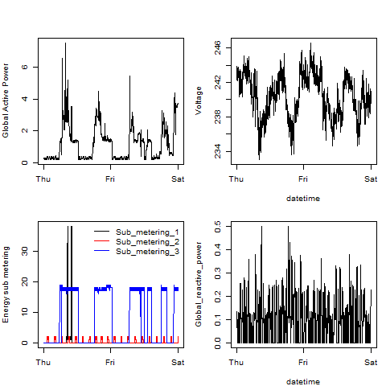

## Introduction

Please read this

Contained in this directory are the 4 R files and the 4 png files constructed from the 4 R files
read
An additional helper file ("read\_data.R) has also been added 

## Plots made for the assignment

The four plots constructed through Plot1.R to Plot4.R

 

### Plot 2

 

### Plot 3

 

### Plot 4

 

